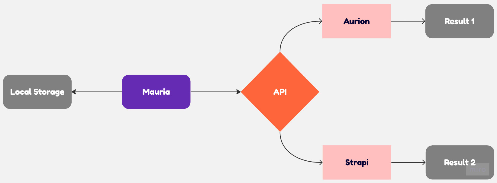

# Mauria (Application mobile)

Mauria est une application mobile disponible sur [iOS](https://apps.apple.com/fr/app/mauria/id6444381612) et [Android](https://play.google.com/store/apps/details?id=io.ionic.mauria).

Elle permet un accès rapide aux données étudiantes disponible sur l'ERP Aurion (par Auriga) pour les étudiants JUNIA.

## Technologies

**Application:** Ionic (React), React

**Serveurs:** Express (NodeJS), Strapi

Mauria fonctionne comme ceci:

## Contributions

Les contributions sont les bienvenues!

Ceci est un projet étudiant, et en tant qu'étudiant, l'aide est toujours un atout ^^

Une contribution permet au projet d'avancer avec les idées de tous. 

Si vous avez une idée sans pour autant avoir les connaissances permettant la réalisation, vous pouvez toujours l'expliquer clairement, avec des schémas par exemple.

Un guide pour contribuer au projet sera disponible (un jour...)
## Auteurs

- [@Milo Montuori](https://www.github.com/MylowMntr)
- [@Louis Lecouturier](https://www.github.com/LouisLecouturier)

## Captures d'écrans

.            |  .            |.            |  .            | .
:-------------------------:|:-------------------------:|:-------------------------:|:-------------------------:|:-------------------------:
  |   |  |  |

